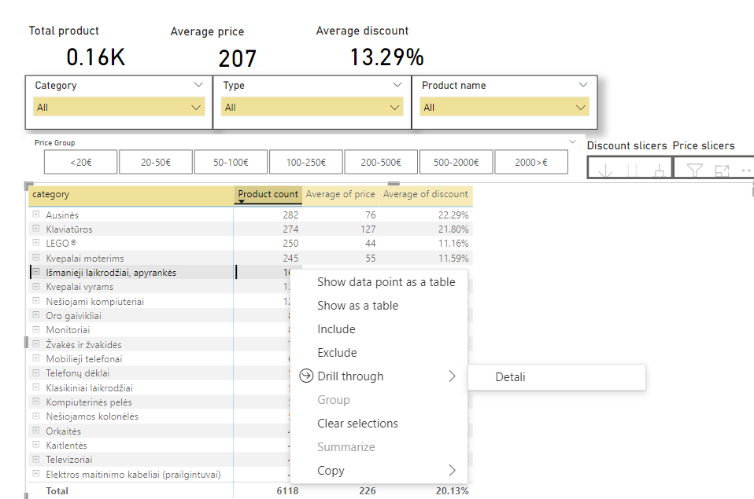

# About Project

Sample project for scraping data from e-shop and visualization with PBI. The project scrapes store discount data

# Project Components

- Scrapp spider (WEB scrapp python module)
- Processing python module (normalize and changes the .json file to .xlsx)
- PBI report

# Power BI

- Buttons to switch filters
- Drill trough to detail table with links to e-shop products

